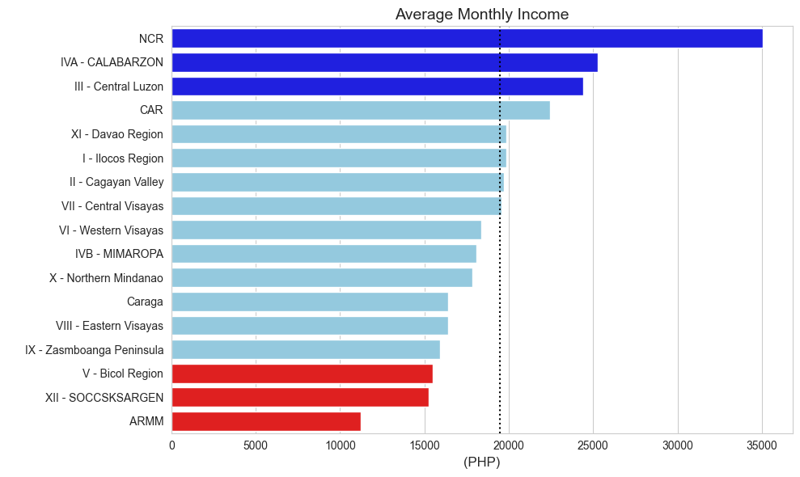
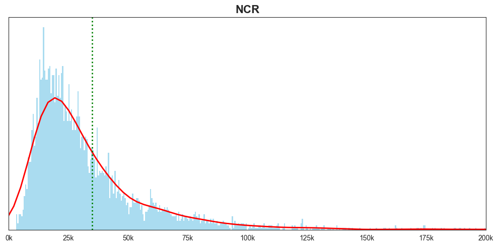
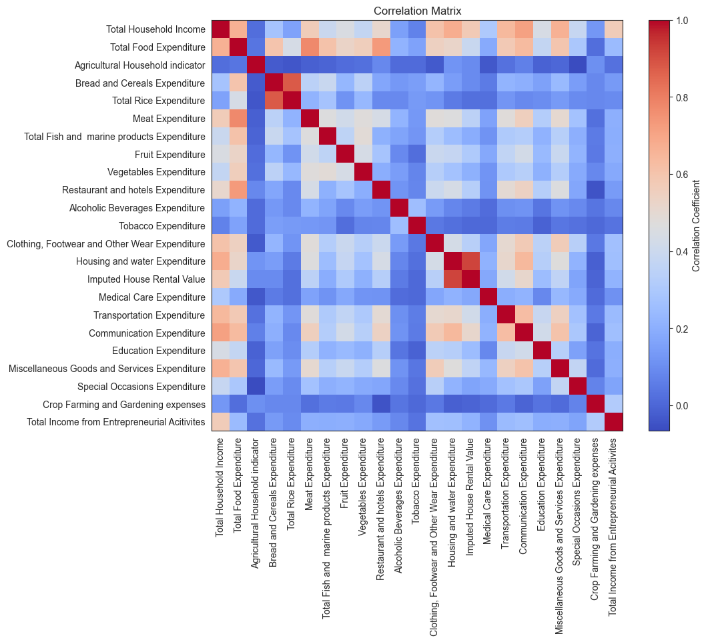
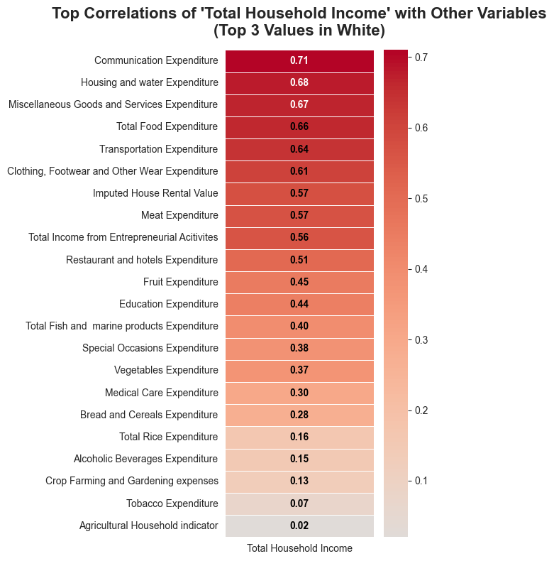
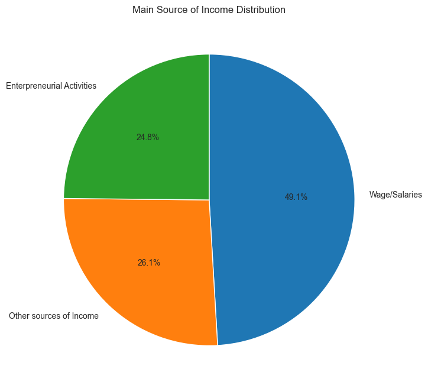
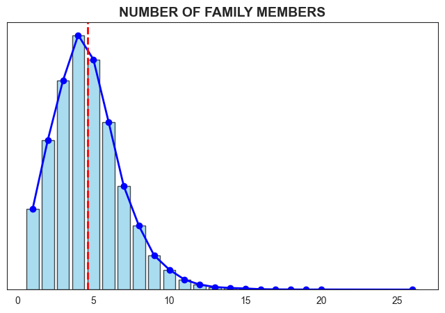

# 📊 Philippines Income & Expenditure Analysis  
*Data Source: Kaggle*

# 📊 Philippines Income & Expenditure Analysis  
*Data Source: [Kaggle](https://www.kaggle.com/datasets/solomonappiahkubi/personal-monthly-expenditure-2021](https://www.kaggle.com/datasets/grosvenpaul/family-income-and-expenditure))*

Explore regional income disparities, household spending patterns, and key correlations that shape Filipino economic behavior. This Python-powered project visualizes critical insights for policymakers, researchers, and anyone curious about the socioeconomic landscape of the Philippines.

---

## 🧰 Tools & Techniques

- **Python Libraries**: `pandas`, `matplotlib`, `seaborn`
- **Data Cleaning**: Null handling, type conversion, outlier filtering
- **Visualization**: Custom color logic, stakeholder-friendly chart design
- **Documentation**: Markdown for clarity and accessibility

---

## 🎯 Project Goals

- Analyze income and expenditure trends across Philippine regions  
- Identify key correlations between income sources and spending habits  
- Visualize data for non-technical audiences using clean, intuitive charts  
- Provide actionable insights for budgeting, policy, and education

---

Explore regional income disparities, household spending patterns, and key correlations that shape Filipino economic behavior. This project visualizes critical insights for policy makers, researchers, and anyone curious about the socioeconomic landscape of the Philippines.

---

## 💰 Regional Income Levels  

This chart compares average monthly income across Philippine regions, revealing stark inequalities.

- 🔝 **Top Earners**: NCR, CALABARZON, and Central Luzon lead the pack.
- 📉 **Below Benchmark**: Most regions fall below the national average of **PHP 19,481** (dashed line).
- 🚨 **Lowest Incomes**: Bicol, SOCCSKSARGEN, and BARMM show the greatest income challenges.

---

## 🛒 Household Income Distribution  
  

These graphs illustrate how income is distributed among Filipino families.

- 📊 **Peak Range**: Most households earn between **PHP 20,000–30,000**.
- 📈 **Right-Skewed**: A few high-income outliers inflate the average, while most earn below it.

---

## 🧮 Correlation Matrix: Income vs. Spending  

This matrix reveals how income types relate to spending categories.

- 🔴 **Red** = Strong positive correlation  
- 🔵 **Blue** = Strong negative correlation  
- ⚪ **White** = Minimal or no correlation  

Use this to identify behavioral patterns and inform budgeting or policy decisions.

---

## 🔗 Top Income-Spending Relationships  

Which expenses rise most with income?

- 🗣️ **Communication** (0.71)  
- 🏠 **Housing** (0.68)  
- 🛍️ **Miscellaneous Goods** (0.67)  
- 🍽️ **Food** (0.66)  
- 🚗 **Transportation** (0.64)  

Higher income leads to broader lifestyle and essential spending.

---

## 🧭 Income Sources  

Where do Filipino households earn their money?

- 💼 **Wages & Salaries**: 49.1%  
- 🌍 **Other Sources**: 26.1% (e.g., remittances, pensions)  
- 🛒 **Entrepreneurship**: 24.8%  

This reflects a diverse economy with both formal and informal income streams.

---

## 👨‍👩‍👧‍👦 Family Size  

Understanding household size helps contextualize income and spending.

- 👨‍👩‍👧 **Typical Size**: 2–6 members  
- 📊 **Average**: ~4 members  
- 📉 **Larger Families**: Less common, but impactful on expenses

---

## 🚀 Get Involved

If you find this project insightful:

- ⭐ **Star** the repo to support visibility  
- 🛠️ **Fork** it to build your own analysis  
- 🗣️ **Share** it with researchers, educators, or policy advocates  
- 🧠 **Contribute** ideas or enhancements via Issues or Pull Requests

Let’s make data-driven decisions more accessible to everyone.

---

## 📬 Contact & Portfolio

Interested in data visualization, automation, or stakeholder-ready reporting? Let’s connect.

- 🌐 [Portfolio Website](https://zipzapph.github.io/Marion.Bautista/)
- 💼 [LinkedIn](https://www.linkedin.com/in/marion-ace-bautista-b3315b2ab)
- 📧 Email: [malb070902@gmail.com](mailto:malb070902@gmail.com)

Open to freelance, consulting, or full-time opportunities in data analysis, visualization, and process automation.

