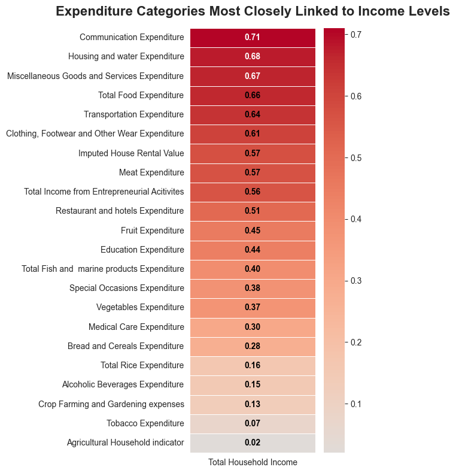
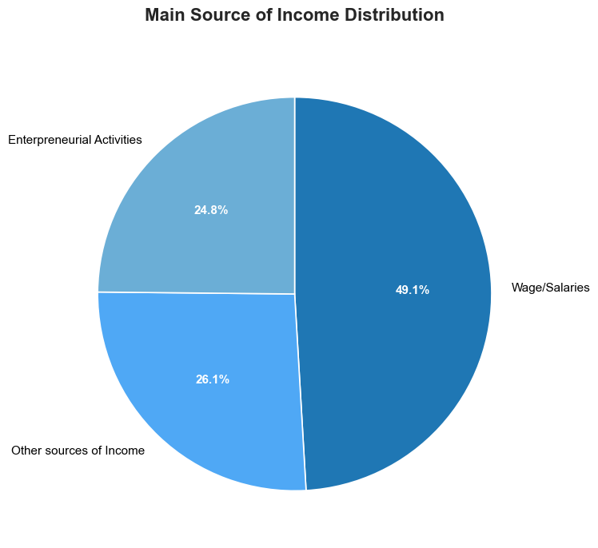

# 📊 Philippines Income & Expenditure Analysis  
*Data Source: [Kaggle Household Income Dataset](https://www.kaggle.com/datasets)*  

---

## 💰 Average Income Levels Across Philippine Regions  

This chart shows the **average monthly income (in PHP)** across different regions in the Philippines.  

- **Top Earners**: The National Capital Region (**NCR**), **CALABARZON**, and **Central Luzon** lead in average income.
- **National Benchmark**: Dashed line represents the national average (~PHP XX,XXX). Only a few regions exceed this.
- **Lowest Incomes**: **Bicol**, **SOCCSKSARGEN**, and **BARMM** fall significantly below the benchmark, highlighting regional inequality.

---

## 🛒 Family Income & Expenditure Distribution  

These graphs show how household income is distributed across the country.  
  

- **Units**: Income values are in **PHP/month**.
- **Most Common Income**: Peak density between **PHP 20,000–30,000**.
- **Skewed Distribution**: Right-skewed, with a long tail of high-income outliers pulling the average upward.

---

## 🔗 Income vs. Expenditure Correlations  

### 🧮 Full Correlation Matrix (All Variables)  
This heatmap shows how different income and expenditure categories relate to one another.  

- 🔴 **Red** = Strong positive correlation  
- 🔵 **Blue** = Strong negative correlation  
- ⚪ **White** = Weak or no correlation  
- **Color Logic**: Consistent red-blue-white scale across all visuals for intuitive reading.

---

### 📊 Top Income Correlations  
This chart simplifies the matrix to highlight the strongest links between income and spending.  

- 🗣️ **Communication** (0.71), 🏠 **Housing** (0.68), 🛍️ **Miscellaneous Goods** (0.67) rise sharply with income.
- 🍽️ **Food** (0.66) and 🚗 **Transportation** (0.64) also show strong positive relationships.
- **Interpretation**: Higher income leads to increased spending across both essentials and lifestyle categories.

---

## 🧭 Main Source of Income  
This pie chart shows the breakdown of household income sources.  

- 💼 **Wages & Salaries (49.1%)**: Dominant source for nearly half of households.
- 🌍 **Other Sources (26.1%)**: Includes remittances, pensions, and passive income.
- 🛒 **Entrepreneurial Activities (24.8%)**: Reflects informal trade and self-employment.

---

## 👨‍👩‍👧‍👦 Family Size  
This chart shows the distribution of household sizes.  

- **Typical Size**: Most families have **2–6 members**.
- **Average**: ~**4 members** per household.
- **Impact**: Family size directly influences expenditure levels and income sufficiency.

---

## 🧭 Suggested Additions (Optional Enhancements)

- 📍 **Regional Heatmap**: Visualize income disparities geographically.
- 📈 **Time Series Trends**: If data spans multiple years, show income/expenditure evolution.
- 🧮 **Income vs. Family Size Scatterplot**: Reveal how household size affects income or spending.
- 🧠 **Interactivity**: Add tooltips or hoverable elements using Plotly or Altair for deeper exploration.

---

## 📌 Notes & Transparency  
- **Dataset Year**: [Insert year]  
- **Sample Size**: [Insert number of households]  
- **Data Cleaning**: Outliers removed, missing values imputed where necessary.  
